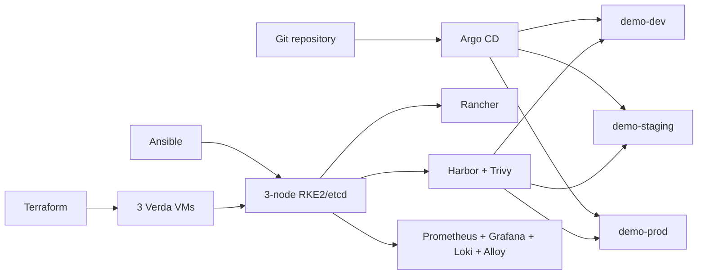

# Verda Cloud Kubernetes Platform

This repository implements a reproducible three-node RKE2 platform on Verda Cloud. Terraform owns the cloud resources, Ansible owns host configuration, and Argo CD owns Kubernetes desired state. Rancher provides cluster management, Harbor and Trivy provide private image storage and scanning, kube-prometheus-stack provides metrics and alerts, and Loki with Grafana Alloy provides centralized logs. One immutable `platform-demo` image is deployed through Git to isolated dev, staging, and production namespaces.

## What is running

| Capability | Implementation | Status | Verification |
|---|---|---|---|
| Infrastructure | Terraform on Verda | Operational | [evidence](evidence/final/01-infrastructure.md) |
| Kubernetes | Three-node RKE2/etcd | Operational | [evidence](evidence/final/02-kubernetes-and-etcd.md) |
| Management | Rancher | Operational | [evidence](evidence/final/03-rancher.md) |
| GitOps | Argo CD root application | Operational | [evidence](evidence/final/04-argocd.md) |
| Registry | Harbor with Trivy | Operational | [evidence](evidence/final/05-harbor-and-scan.md) |
| Metrics | Prometheus, Alertmanager, Grafana | Operational | [evidence](evidence/final/07-prometheus-and-dashboard.md) |
| Logs | Loki with Alloy | Operational | [evidence](evidence/final/09-loki-log-query.md) |
| Environments | dev, staging, production | Operational | [evidence](evidence/final/06-environment-digests.md) |

## Implemented architecture

Delivery is: source -> tests -> build once -> Trivy scan -> Harbor digest -> reviewed Git change -> Argo CD -> dev/staging/prod -> Prometheus metrics and Loki logs.

## Evaluator path

1. Read [SUMMARY.md](SUMMARY.md) and [docs/architecture.md](docs/architecture.md).
2. Use the URLs and separately delivered credentials in [ACCESS.md](ACCESS.md).
3. Run `make validate` from a bootstrapped clone.
4. Run the protected read-only `make verify` with the supplied kubeconfig.
5. Review the [curated evidence index](evidence/final/00-index.md).

## Repository map

- `infra/`: Terraform and Ansible infrastructure/host ownership.
- `gitops/`: Argo CD root and Application definitions.
- `platform/`: management services, policies, storage, and observability.
- `applications/platform-demo/`: the Go application and Helm chart.
- `environments/`: namespace foundations and environment policy.
- `scripts/`: capability-oriented operator commands.
- `docs/` and `evidence/final/`: design, operations, and sanitized proof.

## Tradeoffs

The take-home uses one shared cluster to stay within the credit and review window. Control-plane and application workloads therefore share failure domains, namespace isolation is weaker than separate clusters, Harbor uses its bundled database rather than an external HA service, and public services depend on address-derived `nip.io` names rather than a managed load balancer. A production evolution would separate management and workload clusters, externalize stateful services, use durable DNS and a health-aware ingress/API endpoint, and adopt an enterprise secret platform.

See [known limitations](docs/known-limitations.md), [cost](docs/cost.md), and [operations](docs/operations-model.md).
