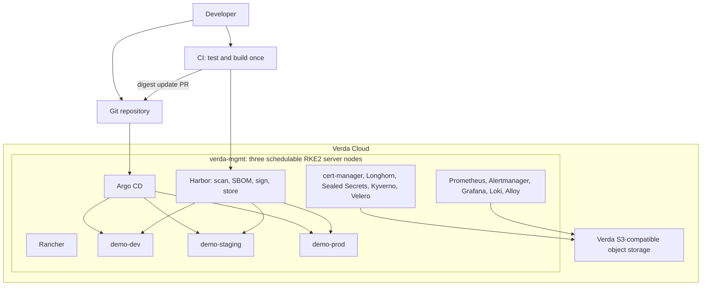
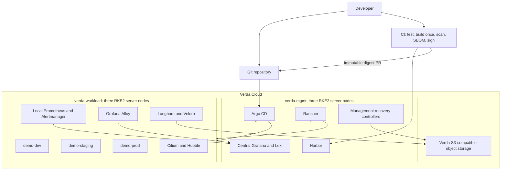

# Architecture Contract

## Delivery thesis

The implementation follows a two-stage strategy. Stage A proves every mandatory assignment link on the smallest credible HA control plane. Stage B is the staff-level target and starts only after Stage A is green, reproducible, secure, evidenced, and affordable.

This replaces the pre-blueprint baseline that treated one co-located cluster as the final take-home target. The change is explicit in ADR-0002; it is not a silent architectural drift.

## Stage A — guaranteed pass path

Stage A is a temporary co-location decision, not the claimed final production pattern. It is complete only when every mandatory acceptance row is green end to end.

## Stage B — staff-level gold target

### Stage B decision gate

Stage B may start only when Stage A is fully green; a clean rebuild needs no undocumented console work; CI-to-dev GitOps works; one alert and one log investigation have been tested; Git history is secret-clean; and remaining credit/time covers the second cluster with contingency.

## Failure domains and claims

| Layer | Permitted claim | Explicit boundary |
|---|---|---|
| Kubernetes control plane | Three embedded-etcd servers tolerate one server loss while quorum remains healthy | Requires a working fixed registration/API endpoint |
| Workload scheduling | Replicated workloads can reschedule when requests, PDBs, spread, and spare capacity permit | Three servers alone do not make applications HA |
| Storage | Longhorn can replicate data across nodes | Replication is not an application-consistent or off-cluster backup |
| External endpoint | Path B: designated public API/registration endpoint plus direct-node break glass and multi-node ingress | No managed LB, floating IP, private VIP, or health-aware DNS is exposed; the designated endpoint is an honest SPOF for default clients and new joins |
| Stage A management | Individual replicas can survive a node loss | A whole-cluster failure removes both management and workloads |
| Stage B management | Management and workload Kubernetes APIs/etcd are independent | Both clusters may still share a Verda region/account |
| Regional recovery | Not claimed | Two clusters in one region are not regional DR |

## Traffic and trust boundaries

| Flow | Source | Destination | Required control |
|---|---|---|---|
| Evaluator UI | Internet | Rancher, Argo CD, Harbor, Grafana | TLS, authentication, scoped reviewer account |
| Application traffic | Internet | Traefik and environment service | TLS and only approved routes |
| Node administration | Approved CIDRs or tunnel | SSH and optional Kubernetes API | Key auth, allowlist, no password/root login |
| Cluster internode | RKE2 nodes | etcd, API, kubelet, CNI, Longhorn | WireGuard overlay, public-IP peer allowlist, host firewall, and tested MTU |
| Artifact push | CI | Harbor | TLS and project-scoped push robot identity |
| Artifact pull | Workload cluster | Harbor | TLS, pull-only identity, digest references |
| GitOps | Argo CD | Git and cluster APIs | Read-only Git credential and scoped cluster credential |
| Logs/metrics | Workload cluster | Management observability | Internal encrypted/TLS route; no public Loki |
| Backups | RKE2/Velero/Loki/Longhorn | Off-cluster S3-compatible storage | Prefer separate Verda credentials if entitlement appears; otherwise use ADR-approved external S3 and document the exception |

## Ownership boundary

The detailed day-zero/day-one contract is in `docs/operations-model.md`. In summary: Terraform owns Verda infrastructure, Ansible owns hosts and RKE2, bootstrap installs only Argo CD plus the root Application, Argo CD owns in-cluster desired state, CI owns artifact production, and Git owns the auditable desired state and promotion history.

## Current implemented posture

Phase 2 created exactly three `CPU.4V.16G` instances and six attached NVMe volumes in `FIN-03`
through Terraform. The immutable Ubuntu 24.04 Minimal configuration UUID remains the live catalog
invariant; ADR 0012 documents why provider 1.1.2 receives its canonical API image type. State is
DPAPI-sealed outside Git with an independent encrypted backup; remote S3 state remains honestly
deferred because object-storage entitlement and locking are unproven.

Phase 2 is green after an explicitly authorized, assertion-bounded replacement of server-02 compute
and its instance-owned OS disk. Its protected data volume retained the original identity and
creation timestamp. Three unique public endpoints, exact attachments, live cost, and zero drift
remain green.

Phase 3 now implements the host trust boundary from ADR 0013. All three nodes use the named
`platform-admin` account with pinned-host-key, key-only sudo access; root and password SSH fail. A
dedicated nftables table allows SSH only from the current approved `/32`, permits WireGuard UDP only
between exact peer endpoints, accepts overlay traffic only from exact overlay peers, and leaves all
future public application and Kubernetes ports closed. Five-minute rollback timers and fresh-session
proofs protect SSH and firewall transitions.

The host WireGuard mesh uses stable addresses in `10.250.0.0/24`, an MTU of 1420 over the measured
1500-byte public underlay, and a reserved future Cilium VXLAN MTU of 1370. Every one of the six
directed no-fragment paths, recent peer handshakes, and a sustained three-node traffic ring passed.
Each protected data volume is ext4-formatted only after full empty-media proof, mounted by UUID at
`/var/lib/longhorn`, and verified after all three nodes rebooted serially. Full post-reboot
convergence is zero-change. Provider 1.1.2 and CLI 1.8.1 still expose no managed private network or
HA endpoint, so Path B remains an explicit limitation rather than a cloud-private-network claim.

RKE2, Kubernetes, Cilium, Longhorn itself, ingress, DNS, and all platform services remain absent.
The 1370 MTU and internal port reservations are Phase 4/5 inputs, not implemented-service claims.
