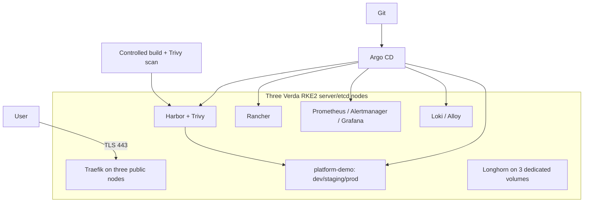

# Architecture

## Implemented architecture

The submission is one three-node RKE2 cluster. Each Verda VM is both an RKE2 server/etcd member and a schedulable worker. Terraform owns instances and volumes; Ansible owns Ubuntu, WireGuard, firewall, storage mounts and RKE2; Argo CD owns every steady-state Kubernetes resource after bootstrap.

## Responsibilities and trust boundaries

- Terraform changes the Verda resource boundary only from a reviewed saved plan.
- Ansible changes hosts serially and preserves direct recovery access.
- Argo CD reconciles reviewed Git state; CI never deploys directly.
- Harbor is private; workload namespaces receive pull-only robot credentials outside Git.
- TLS terminates at Traefik with cert-manager certificates. SSH and Kubernetes administration remain restricted.
- Environment namespaces use service accounts, quotas, restricted pod security and default-deny network policy.

## Delivery and failure domains

The application is tested and built once, scanned, pushed to Harbor, and referenced by digest. Promotion changes only Git environment values. One cluster means a cluster-wide failure affects management and workloads; three etcd members, replicated Longhorn volumes, Git desired state and snapshots reduce but do not remove that risk.

## Production evolution — not implemented

A larger production platform would separate management and workload clusters, use managed DNS and health-aware load balancing, externalize Harbor/Loki databases and object storage, add enterprise OIDC/secrets, and test regional recovery.
