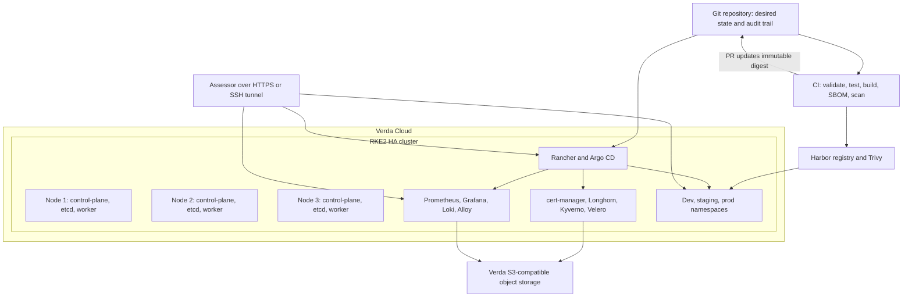

# Architecture Contract

## Decision summary

The implemented platform is a cost-bounded, three-node RKE2 cluster that demonstrates production disciplines without claiming to be the final production topology. Dev, staging, and production share the cluster but receive policy and tenancy boundaries. Rancher is co-located for the take-home only.

## Implemented topology

## Component ownership boundaries

| Layer | Owner and source of truth | Recovery authority |
|---|---|---|
| Verda compute and volumes | Terraform | Terraform state plus Verda API |
| Host OS and RKE2 configuration | Ansible and bootstrap assets | Re-provision host; restore etcd only when required |
| Platform services | Argo CD from Git | Reconcile from Git plus component data restore |
| Application desired state | Git environment overlays | Revert promotion commit |
| Container artifacts | Harbor | Registry/database restore or rebuild from source |
| Cluster state | Kubernetes API and etcd | RKE2 snapshots |
| Persistent application state | Longhorn volumes | Longhorn and Velero restore |
| Logs and backups | Verda object storage | Object-storage retention and recovery credentials |

## Environment isolation

The take-home uses namespaces because three independent HA clusters would consume time and credits without proportionate evaluation value. Each environment will have:

- A dedicated namespace and service account.
- ResourceQuota and LimitRange.
- Restricted Pod Security Admission.
- Default-deny ingress and egress NetworkPolicies.
- Explicit DNS, ingress, monitoring, and application dependencies.
- Its own Argo CD project boundaries and hostname.
- A distinct Git overlay pointing to an immutable image digest.

This is not equivalent to cluster-level isolation. The production target uses separate clusters and credentials, especially for production.

## Network trust zones

| Zone | Intended ingress | Notes |
|---|---|---|
| Public application edge | TCP 80/443 | HTTP redirects to HTTPS; only approved ingress hosts |
| Administrative edge | SSH and Kubernetes API from allowlisted sources or tunnels | No unrestricted administrative endpoint |
| Node peer network | RKE2, etcd, kubelet, and CNI ports from cluster peers only | Prefer private addresses; otherwise validate encrypted overlay and MTU |
| Cluster service network | Kubernetes NetworkPolicy-controlled | Platform namespaces receive explicit exceptions only |
| Object storage | Outbound TLS | Separate, least-privilege credentials for backup and logging paths |

The exact port matrix remains a Phase 3 artifact because it depends on the selected RKE2/Cilium versions and observed Verda network behavior.

## Availability claims

| Capability | Intended claim | Constraint |
|---|---|---|
| Kubernetes API data | Tolerates one server failure | Requires healthy etcd quorum and stable registration/client endpoint |
| Workload scheduling | Tolerates one worker failure for replicated workloads | Stateful recovery depends on validated Longhorn behavior |
| Rancher and Argo CD pods | Multiple replicas | Co-located with the workload cluster |
| Public ingress | Best effort until external endpoint behavior is verified | Multiple replicas do not create a highly available public IP by themselves |
| Dev/staging/prod isolation | Policy and namespace isolation | Not a separate control-plane boundary |
| Backups | Off-cluster copy | Not complete until a restore drill passes |

## Production target

The target production architecture separates:

- A dedicated HA Rancher management cluster.
- Independent dev, staging, and production workload clusters.
- A highly available external L4 load balancer and managed DNS.
- External identity and secret-management systems.
- Registry and observability capacity sized independently from application workloads.
- Backup credentials and recovery infrastructure in a separate administrative boundary.

## Non-goals for the take-home

- Claiming multi-region or datacenter fault tolerance.
- Installing every optional platform tool.
- Creating a custom operator when standard controllers suffice.
- Treating dashboards as proof without tested queries and alerts.
- Treating encrypted Git secrets as equivalent to an external production secret manager.
