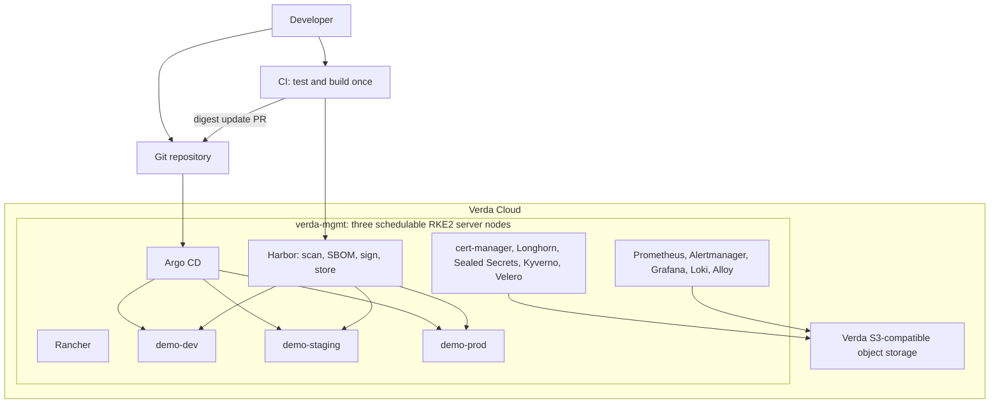
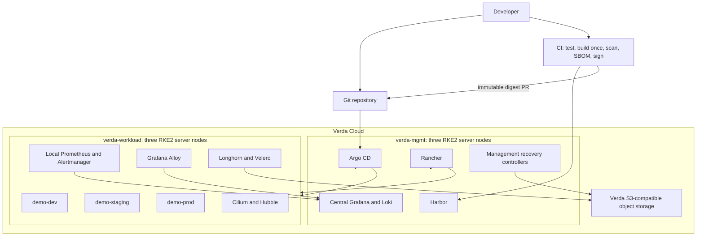

# Architecture Contract

## Delivery thesis

The implementation follows a two-stage strategy. Stage A proves every mandatory assignment link on the smallest credible HA control plane. Stage B is the staff-level target and starts only after Stage A is green, reproducible, secure, evidenced, and affordable.

This replaces the pre-blueprint baseline that treated one co-located cluster as the final take-home target. The change is explicit in ADR-0002; it is not a silent architectural drift.

## Stage A — guaranteed pass path

Stage A is a temporary co-location decision, not the claimed final production pattern. It is complete only when every mandatory acceptance row is green end to end.

## Stage B — staff-level gold target

### Stage B decision gate

Stage B may start only when Stage A is fully green; a clean rebuild needs no undocumented console work; CI-to-dev GitOps works; one alert and one log investigation have been tested; Git history is secret-clean; and remaining credit/time covers the second cluster with contingency.

## Failure domains and claims

| Layer | Permitted claim | Explicit boundary |
|---|---|---|
| Kubernetes control plane | Three embedded-etcd servers tolerate one server loss while quorum remains healthy | Requires a working fixed registration/API endpoint |
| Workload scheduling | Replicated workloads can reschedule when requests, PDBs, spread, and spare capacity permit | Three servers alone do not make applications HA |
| Storage | Longhorn can replicate data across nodes | Replication is not an application-consistent or off-cluster backup |
| External endpoint | Unverified | No managed LB, floating IP, private VIP, or health-aware DNS has been proven in the current account |
| Stage A management | Individual replicas can survive a node loss | A whole-cluster failure removes both management and workloads |
| Stage B management | Management and workload Kubernetes APIs/etcd are independent | Both clusters may still share a Verda region/account |
| Regional recovery | Not claimed | Two clusters in one region are not regional DR |

## Traffic and trust boundaries

| Flow | Source | Destination | Required control |
|---|---|---|---|
| Evaluator UI | Internet | Rancher, Argo CD, Harbor, Grafana | TLS, authentication, scoped reviewer account |
| Application traffic | Internet | Traefik and environment service | TLS and only approved routes |
| Node administration | Approved CIDRs or tunnel | SSH and optional Kubernetes API | Key auth, allowlist, no password/root login |
| Cluster internode | RKE2 nodes | etcd, API, kubelet, CNI, Longhorn | Verda private network if proven; otherwise WireGuard and peer allowlist |
| Artifact push | CI | Harbor | TLS and project-scoped push robot identity |
| Artifact pull | Workload cluster | Harbor | TLS, pull-only identity, digest references |
| GitOps | Argo CD | Git and cluster APIs | Read-only Git credential and scoped cluster credential |
| Logs/metrics | Workload cluster | Management observability | Internal encrypted/TLS route; no public Loki |
| Backups | RKE2/Velero/Loki/Longhorn | Verda object storage | Separate least-privilege credentials where supported |

## Ownership boundary

The detailed day-zero/day-one contract is in `docs/operations-model.md`. In summary: Terraform owns Verda infrastructure, Ansible owns hosts and RKE2, bootstrap installs only Argo CD plus the root Application, Argo CD owns in-cluster desired state, CI owns artifact production, and Git owns the auditable desired state and promotion history.

## Current Phase 0 posture

No cloud resource exists. Provider 1.1.2 exposes compute, volume, SSH-key, startup-script, container, registry-credential, and serverless-job resources, but no data sources and no network, firewall, load-balancer, floating-IP, DNS, or object-storage resources. That provider absence is not proof that the Verda account lacks those services; authenticated API/CLI/console discovery is still required.
